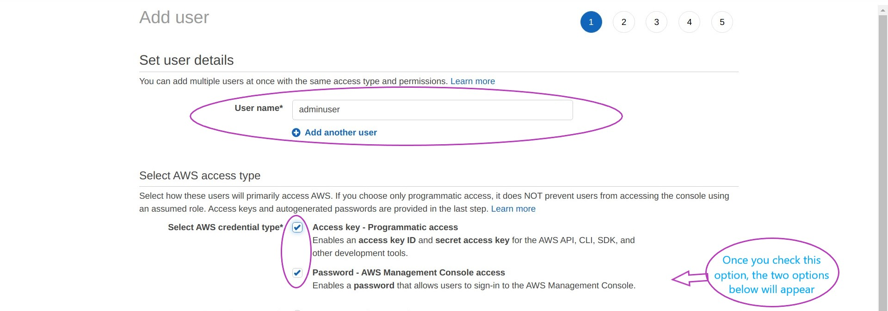
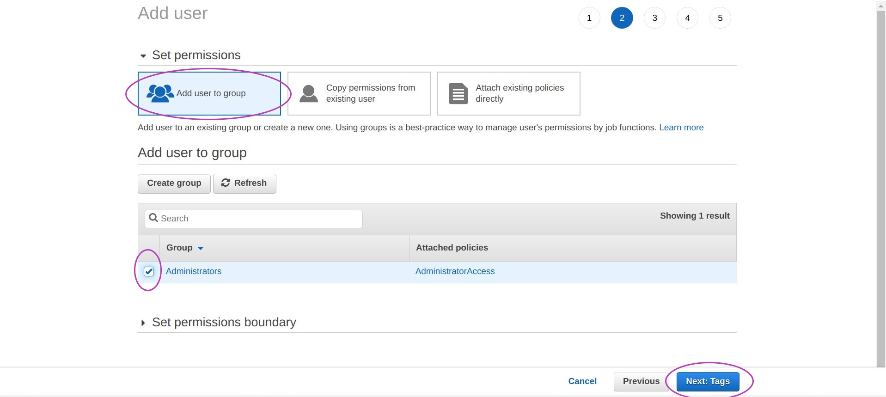
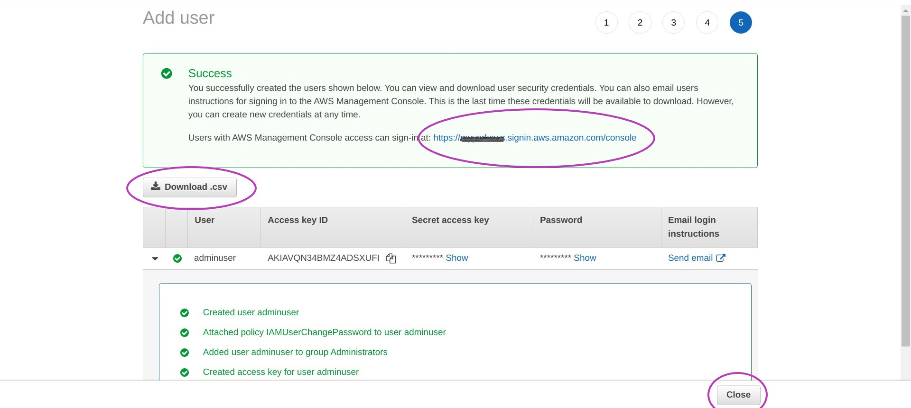

> ## Prerequisites
> To complete this episode you will need:
> - to have opened your AWS account as described in the first episode of this lesson: [Create Your AWS Account](../01-create-your-account). 
> - to be logged in to your AWS account as the **Root User** (described also in that episode, at the end). 
> - ideally, your mobile phone to add multi-factor authentication (**MFA**) to your AWS account. However, **if you don't have a mobile phone, you can skip this step** and still use your AWS account.
{: .prereq}

# Outline
> ## Steps
> These are the main steps you will follow to configure your AWS account:
>
> 1. **[Change the default region of your account to Ireland.](#1-change-the-default-region-of-your-account-to-ireland)**\
> AWS services are provided through many regions around the world and a region is allocated by default. You will need to change the region of your account to Ireland because the Amazon Machine Image from which you will create your AWS instance is stored in the Ireland region. But you can later change your account region if you wish.  
>
> 2. **[Secure your AWS Root User account.](#2-secure-your-aws-root-user-account)**\
> The account your created in the last episode is your Root user account and can perform any operation including closing the account. It is best practice to use the Root user account only for high-level administration and to create the first **IAM** (Identity Access Managment) user account for day-to-day work and account management. It is also best practice to secure the Root user account with multi-factor authentication (MFA).
>
> 3. **[Create an IAM user account to create and manage AWS resources.](#3-create-an-iam-user-account-to-create-and-manage-your-instance)**\
> IAM user accounts are attached to a **User Group** that has a set of specific permissions (such as reading, writing and deleting) on specified resources. We will create a User Group with predefined permissions and an IAM user account in that group. 
>
> 4. **[Create an alias for your account id.](#4-create-and-alias-for-your-iam-user-acount)**\
> Your Root user account id is a 12-digit number that is difficult to remember. We are going to create an alias that is easier to remember. This is especially useful because the alias will replace the 12-digit number in the web address for logging in to your account as IAM user. 
>
> 5. **[Grant your IAM user account the permissions to access the Billing Dashboard.](#5-grant-your-iam-user-account-the-permissions-to-access-the-billing-dashboard)**\
> The Billing Dashboard of your account is only accessible to the Root user by default. As you will mostly be using your IAM user account, it is convenient that you can check your bills and related information with your IAM user account too. We are going set on the permissions that enable your IAM user account to access the Billing Dashboard. 
{: .callout}

## 1. Change the default region of your account to Ireland

Once you have logged to your AWS Root user account, your browser will display a page showing the default region in the top right. This may be **N. Virginia** or another default.

Change the region to Ireland: click on the region name that is shown and in the drop-down menu that pops up, select **Europe (Ireland) eu-west-1**. 

{: width="900px"}

> ## Note
> You can change the region any time you need. 
{: .callout}

## 2. Secure your AWS **Root user** account

We now are going to add multi-factor authentication (MFA) to your Root user account as an extra security mechanism. This requires you to download an app to your mobile phone, as described below. 

> ## No mobile phone?
> If you don't have a mobile phone, don't worry, you can skip this step and go straight to **3. Create an IAM user account to create and manage your instance**.  
> If you are not using MFA it is best to use your AWS Root user account only from your personal computer or a trusted computer.
{: .callout}

Type **iam** in the AWS search box at the top and press Enter. 
{: width="900px"}

You will be presented with the "IAM Dashboard". Click on **Add MFA**.

{: width="900px"}

On the page that appears, "Your Security Credentials", click **Activate MFA**.

{: width="900px"}

A pop-up window called "Manage MFA device" will appear. Select **Virtual MFA device** and **Continue**.

{: width="900px"}

You will now be presented with a pop-up windows called "Set up a virtual MFA device". Do not select anything at the moment.

{: width="900px"}

To set up your mobile as MFA device you will need a Virtual MFA app on your mobile phone. We have tested both "Duo Mobile" and "Google Authenticator" and give instructions for both but you may already be using another app. AWS lists some options here: [AWS MFAs](https://aws.amazon.com/iam/features/mfa/).

**If you do not have a Virtual MFA app on your mobile phone:**
Go to the app store on your phone, search for Duo Mobile *or* Google Authenticator, and install it.

Once you have installed an MFA app in your mobile:
- Return to the above pop-up "Set up a virtual MFA device" on your computer and choose **Show QR code**.
- Open the MFA app on your phone
  - Press **+ Add** in Duo Mobile or **+** in Google Authenticator 
  - Press **Use QR code** in Duo Mobile or **Scan a QR code** in Google Authenticator. Your camera will open to scan a QR code.
  - Point your camera at your computer screen showing the QR code to scan. You may need to adjust the zoom for the scan to occur.
- Once the scan is successful, the MFA app will display a number for about 30 seconds, and then another number for the same time, and so on until you close the app. 
- Of those numbers shown in your mobile MFA, you need to enter two consecutive numbers into the fields **MFA Code 1** and **MFA Code 2** on the last pop-up window "Set up a virtual MFA device" on your computer. You may need to scroll down to see MFA Code 2. **NB: enter the numbers with no space between them** even if they are shown with a space in your mobile.
- Click on **Assign MFA**. 

You will see a success message which you can close.

Every time you login to your Root user account, you will be asked to enter your password and an MFA code number which you must read from your mobile by simply opening the MFA app.

## 3. Create an IAM user account to create and manage your instance

We are going to create an IAM user account with which you will be able to create and manage AWS resources. This involves first creating an IAM User Group with one or more security policies, and then your IAM user account within that User Group.

We will create a user group called **Administrators**, then a user account called **YourName** (your actual name), and finally attach the account to the group. As this is the first IAM group and IAM account to be created, we need to do this with the Root user account, but then it will be possible to do it with the IAM account we will create because it will have Administrator privileges.

### 3.1 Create the user group

Go to the IAM Dashboard page by typing **iam** in the AWS search box at the top and pressing Enter. On the IAM Dashboard, click on "User groups" under "Access Management" on the left, and then on **Create group** on the right.

{: width="900px"}

In the page that appears, "Create user group", type "Administrators" in the box "User group name" but **don't press** Enter yet. 

{: width="900px"}

Scroll down until you see the section "Attach permissions policy - *Optional*". This section has a search box and a list of different policies.

Type "administratoraccess" in the search box and press Enter.

{: width="900px"}

This will bring the "AdministratorAccess" policy to the top of the list. Check the box next to that policy and then click on **Create group**. 

{: width="900px"}

The screen displayed after creating the group may indicate it is loading users --- it's OK, ignore it.

You now have a user group called **Administrators**

{: width="900px"}

### 3.2 Create your IAM user account and add it to the Administrators group

To create your IAM user account, click on **Users** in the last page displayed in the previous step, on the left in the figure above.

The page titled "Users" will be displayed. Click on **Add users**. 

{: width="900px"}

The page below will be displayed, where you can enter your IAM user account details by:
- typing your user name (**a single word** of your choice) 
- checking the box "Access Key - Programmatic access" --- this option enables you to use the AWS CLI
- checking the box "Password - AWS Management Console access"
- checking the box "Autogenerated password" and 
- checking the box "User must create a new password at next sign-in"

Then click on **Next: Permissions**

{: width="900px"}
{: width="900px"}

You will be presented with a page that says "Add user - Set permissions". The **Add user to group** option should be set (in blue). Leave it set --- if it is not set, click on it to set it. 

Check the box next to the group Administrators and then click on **Next: Tags**.

{: width="900px"}

You will be presented with a page that says "Add user - Add tags (optional)", not shown here as we are not adding tags. Click on the button **Next: Review**.

> ## Note on tags
> Adding tags --- or keywords --- to an AWS resource is optional. You don't need to tag your IAM user account because you only have one such account. Adding tags is useful when you are managing multiple user accounts/resources as it helps searching for specific resources based on their tags.
{: .callout}

Your will now be presented with a page displaying the options chosen for your IAM user account for review. If these are correct click on **Create user**.

{: width="900px"}

You will now see a page with the message ***Success --- You successfully created the users shown below...***

**You need to download** the .csv file indicated in this page by clicking on **Download .csv**. This file contains the **credentials** both to login to the AWS Console and to access AWS resources programmatically with your new IAM user account. *Programmatically* means access from software applications including the AWS CLI. 

For security reasons **you will not be able to access these credentials once you leave this page** but you can create new credentials. 

Click on **Download .csv** to download and save the file in your computer.
 
{: width="900px"}

> ## What's in the file?
> The file you downloaded is a *comma separated value* (CSV) file that you can open in any text editor. Its content is something like this:
> 
> `User name,Password,Access key ID,Secret access key,Console login link`
> `adminuser,0ji)8[bN3{F-X!h,BMZ4AD..KIAVQN34,o0/bSO3WJeO..Vgtc4E3LxXZVbQg,https://xxxxxxxxxxxx.signin.aws.amazon.com/console`
> 
> The first line specifies the names of the comma-separated values in the second line --- comma characters are not part of any of the values. 
> 
> The values in the second line shown above will be different to those in your CSV file. 
>
> The first and second fields, `adminuser` and `0ji)8[bN3{F-X!h` are the username and the password to access the AWS Console. The third and the fourth fields, `BMZ4AD..KIAVQN34` and `o0/bSO3WJeO..Vgtc4E3LxXZVbQg`, are the *access key ID* and the *secret access key* which, combined, will enable you to use the AWS CLI and, more generally, to access AWS resources programmatically. The last field, `https://xxxxxxxxxxxx.signin.aws.amazon.com/console`, is the web address to login to the AWS Console with the IAM user account you have created, and other IAM accounts you may create later.
> 
> **NB**: the first time you login to the AWS Console you will have to change the password. 
>
> **NB**: we are representing here with "xxxxxxxxxxxx" the digits in the URL to login to the AWS Console, `https://xxxxxxxxxxxx.signin.aws.amazon.com/console`. This 12-digit number corresponds to your account id.
{: .callout}

Once you close the success message above, in the page that appears you should see the user account you have just created, listed along with the Groups (Administrators) of which it is a member and other information, for example: "Never" under "Last activity" means you have not yet logged in.

## 4. Create and alias for your IAM user acount

A 12-digit number can be difficult to remember so let's create an alias which is easier to remember. The alias can be used to login to your account.

Type **iam** in the AWS search box and press Enter to go to the "IAM Dashboard".

On the right of the Dashboard, under the heading "AWS Account", click on **Create** next to "Account Alias"

{: width="900px"}

Now enter the alias you want to use --- which might be some version of your name or date of birth. Note the new sign-in URL. Click on **Save changes**.

{: width="900px"}

You can now login to your account using either web address: the one with your 12-digit account number or the one with your alias.

> ## Access your IAM user account with both URLs: 
> - open two **new** tabs in your browser (but do not close this browser tab so that we can finish up setting up your IAM account with the last step below).
> - enter `https://xxxxxxxxxxxx.signin.aws.amazon.com/console` in one of the tabs, but change "xxx..xxx" with your 12-digit account number.
> - enter `https://youralias.signin.aws.amazon.com/console` in the other tab, but change "youralias" with your actual account alias.
> - in both tabs use your actual **username** and **password** from your .csv file. 
{: .callout}

## 5. Grant your IAM user account the permissions to access the Billing Dashboard

To grant your IAM user account the permissions to access the Billing Dashboard, go to the Account Settings page as follows:
  
- on the navigation bar at the top, on the far right, click on your "*account name*" (or account number, if you did not setup an account alias), and 

- on the drop-down menu that pops up, click on **Account**

{: width="900px"}

On the page that appears:

- Scroll down until you see the heading:

&nbsp; &nbsp; &nbsp; &nbsp; **IAM User and Role Access to Billing Information**

- To the right of the heading, click on **Edit**.

- Check **Activate IAM Access**.

- Click on **Update**.

You have now configured your AWS account for day-to-day use.  
