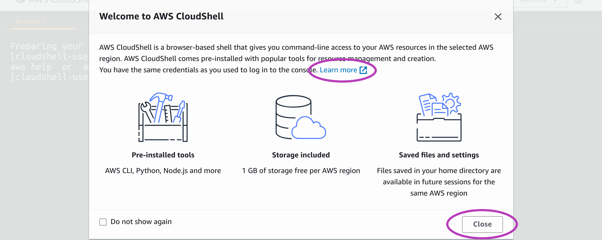
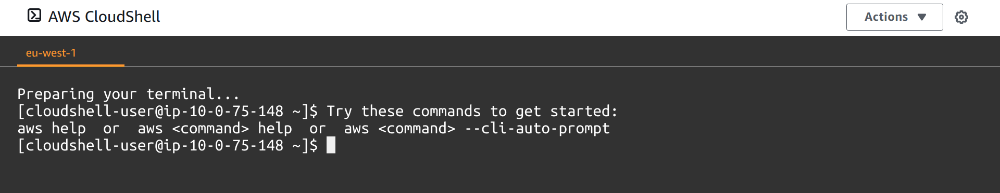

> ## Prerequisites
> This episode will guide you to set up the **AWS CloudShell environment** or a **Linux machine environment** from which to run the Scripts that manage multiple AWS instances.
>
> To complete this episode you will need:
> - to have opened and configured your AWS account as described in the first and second episodes of this lesson: [Create Your AWS Account](./01-create-aws-account) and [Configure Your AWS Account](02-configure-aws-account).
> 
> - for the AWS CloudShell environment you will need:
>   - the AWS Console login credentials of your IAM user account: login page, username and password.
>
> - for a Linux machine environment you will need:
>   - the access keys associated with your IAM user account.
>   - to have your Linux environment configured with:
>     - the *terminal* program running the Bash shell (default in Linux but check)
>     - these programs installed: `git`, `curl`, `unzip`, `ssh`
{: .prereq}

# Introduction
This is the last episode of the lesson [Setting Up Your Cloud and Linux Environments](../index). The previous two episodes guided you to set up your Cloud environment which is your AWS account configured with both Management Console access and **Programmatic access to AWS services**.  Programmatic access is based on the use of an **access key ID** and a **secret access key**, and is the type of access that is used by the Scripts that manage multiple AWS instances and related resources (IP addresses, domain names, etc.) within the AWS account associated with the keys used. 

This episode will guide you to configure your Linux environment from which you will invoke the Scripts configured to use your AWS account. 

**The configuration of your Linux environment includes**: 

- installing the **Scripts**
- installing and configuring the **AWS CLI** to use the *access key ID* and the *secret access key* associated with your IAM user account in the previous episode.

By **installing** some software we mean both **downloading** that software and **configuring** the execution path of the enviroment so that that software is accessible/runnable from any location in the environment.

The configuration presented in this episode is **applicable to these Linux environments**:
- the AWS CloudShell which runs on the AWS Cloud --- see callout below
- any of these Linux settings:
  - a Linux laptop or desktop machine.
  - a Linux virtual machine running within VMware (or Virtual Box, etc.) --- and VMware (Virtual Box, etc.) running on a Windows, Linux or MacOS laptop or desktop machine.
  - a remote Linux server (e.g., an AWS Linux instance) accessed with `ssh`.
  - Ubuntu Linux within the Windows Subsytem for Linux (WSL) running on a Windows laptop or desktop machine.

> ## the AWS CloudShell
> The AWS CloudShell "is a browser-based \[Bash\] shell \[*terminal*\] that gives you command-line access to your AWS resources **in the selected AWS region**".
>
> The AWS CloudShell: 
> - can only be invoked while you are logged in to the AWS Console. 
> - runs on a Linux AWS instance whose input and output are directed to (entered through and displayed to) the browser tab where it was invoked. 
>   - the instance has 1 GB storage as a Linux file system
>   - data and software that you install in your home directory will be preserved between sessions, but **will be deleted** if AWS CloudShell is not used for 120 days --- you will receive warning emails before it is deleted so you can access it again.
>   - You can install software at system-wide level but you will have to reinstall it every time you access the AWS CloudShell.
> - **has installed and configure the AWS CLI** among other software such as: Python, Node.js, git, make, pip, etc. Hence **you don't need to install the AWS CLI**. The AWS CLI has **programatic access** to AWS resources using temporary security credentials based on the credentials to access the AWS Console --- this is completely transparent to the user.
{: .callout}

> ## Other options to run the Scripts whose configuration is **not** covered in this episode
> - **GitBash** running on a Windows laptop or desktop machine
> - a **terminal** running the Bash shell on a MacOS laptop or desktop machine
{: .callout}

# Outline 

> ## Steps --- AWS CloudShell environment
> These are the main steps you will follow to configure your AWS CloudShell environment:
>
> 1. **[Download the Scripts from GitHub to the AWS CloudShell](#configuring-the-aws-cloudshell-environment).**\
> You are going to login to the AWS Console with your IAM user account, launch the AWS CloudShell, and download the Scripts from GitHub.
>
> 2. **[Make the Scripts accessible through the execution path in the AWS CloudShell](#2-make-the-scripts-accessible-through-the-execution-path-in-the-aws-cloudshell).**\
> You are going to create a new "bin" directory, copy the Scripts therein, add the new bin directory to the execution path, and test that the Scripts are accessible from any location in your environment.
{: .callout}

> ## Steps --- Linux machine environmnet (any other than the AWS CloudShell)
> These are the main steps you will follow to configure your Linux machine environment:
>
> 1. **[Download the Scripts from GitHub to your Linux machine](#configuring-your-linux-machine-environment).**\
> You will use a terminal to download the Scripts from GitHub.
>
> 2. **[Make the Scripts accessible through the execution path in your Linux machine](#2-make-the-scripts-accessible-through-the-execution-path-in-your-linux-machine).**\
> You are going to create a new "bin" directory, copy the Scripts therein, add the new bin directory to the execution path, and test that the Scripts are accessible from any location in your environment.
>
> 3. **[Install and configure the AWS CLI on your Linux machine](#3-install-and-configure-the-aws-cli-in-your-linux-machine).**\
> You will run a script, or run a few commands, to download the AWS CLI and to configure the exectution path. Then you will configure the AWS CLI to use the access key ID and a secret access key of your IAM user account. 
{: .callout}

# Configuring the AWS CloudShell environment
## 1. Download the Scripts from GitHub to the AWS CloudShell
To access the AWS CloudShell environment and download the Scripts therein, you need to be logged in to the AWS Console with your IAM user account. 

Open a new browser window and enter the address of the login page for your account IAM users. The address contains the account alias or your 12-digit account number:

- https://**youraccountalias**.signin.aws.amazon.com/console
- https://**123456789012**.signin.aws.amazon.com/console

Enter your IAM username and password. You may also get a **Security check** to complete.

Once you are logged in, a page like the one below will appear.

**IMPORTANT**: On the top right, check that the region is set to Ireland. **Set it to Ireland if it is not**:

An AWS CloudShell that you launch can only operate on resources within a selected region. Since the  Amazon Machine Image (AMI) from which you will create AWS instances with the Scripts is located in the Ireland region, you need to select this region before launching the AWS CloudShell.  

(Note: you can launch multiple AWS CloudShells, each operating on a different region, but this is not needed and hence not covered in the course.)

#### **Launching the AWS CloudShell**

To launch the AWS CloudShell, click on its icon at the top: the little square with these two characters "**>_**" inside.

{: width="900px"}

You will be presented with the message "Welcome to AWS CloudShell" below. 

If you would like to learn more about the AWS CloudShell (software available, installing software, etc.), click on **Learn more**. A new browser tab will be opened with the online documentation about the AWS CloudShell.

Click on **Close** to get to the AWS CloudShell.

{: width="900px"}

You will now be presented with the AWS CloudShell terminal, like the one below. 

It may take up to a couple of minutes for the AWS CloudShell terminal to be ready the first time you open it in a Console session:
- first, an AWS instance called **the environment** will be launched --- you will see the message "Waiting for the environment to run ...", not shown below
- then the **terminal** program will be run --- you will see the message "Preparing your terminal ...". 
- finally, you will see the terminal **prompt**, something like this: **[cloudshell-user]@ip-11-22-33-44 ~]$** --- the numbers in the prompt are the IP address of the instance and may differ every time you open the AWS CloudShell.

The message after the first prompt, "Try these commands to get started: aws help ...", means that the AWS CLI, whose name when used is `aws`, is ready to be used.

{: width="900px"}

#### **Downloading the Scripts**

To download the Scripts, enter or copy-paste the git command below into the terminal and press Enter. 

(Please press Enter after each command you are asked to enter or copy-paste into the terminal; it won't be recalled anymore.) 
~~~
$ git clone https://github.com/Cloud-SPAN/aws-instances.git ~/_tmp_cloudspan_aws
~~~
{: .bash}

Now enter the command `ls -a ~` to list all the files (visible and hidden) in your home directory which is represented by the `~` character:
~~~
$ ls -a ~
~~~
{: .bash}

The terminal should now look similar to the following. If so, you have downloaded the Scripts into the **_tmp_cloudspan_aws** directory in your home directory. 

{: width="900px"}

## 2. Make the Scripts accessible through the execution path in the AWS CloudShell
There are many ways to make the Scripts accessible through the execution path. To avoid any conflicts with the current configuration of the AWS CloudShell, we are going to:
1. create a new "bin" directory within your home directory (`~`)
2. copy the Scripts to the new bin directory
3. add the new bin directory to the execution path

You can copy-paste the commands below to carry out those three steps using `~/.local/bincsaws` as the new bin directory, **but please note**:

**If** `~/.local/bincsaws` **already exists** in your environment (which you can check with the command `ls ~/.local`), choose another name for `bincsaws` and use the new name instead of `bincsaws` in the three commands below:

~~~
$ mkdir -p ~/.local/bincsaws
$ cp ~/_tmp_cloudspan_aws/*.sh  ~/.local/bincsaws
$ echo "PATH=\"\$HOME/.local/bincsaws:\$PATH\"" >> ~/.bashrc
~~~
{: .bash}

The command `echo ... >> ~/.bashrc` adds an assignment shell statement at the end of the Bash configuration file `~/.bashrc`. The statement adds the new bin directory to the execution path which is held by the shell variable `PATH`.

Since the *terminal* program runs the commands in `~/.bashrc` every time it is launched, the assigment shell statement will add the "new" bin directory to the execution path on every subsequent launch of the AWS CloudShell. 

That means that the Scritps **are just not yet accessible through the execution path**.

For the Script to become thus accessible, we need either to restart the *terminal*, or to restart the AWS CloudShell, or to run the `source` command to make the **current** *terminal* run the commands in `~/.bashrc` again, and thus get the PATH variable updated within this terminal session.

Let's use the `source` command to test the Scripts are accessible through the execution path, and then look at how to restart the terminal and the AWS CloudShell.

Enter or copy-paste the following commands:
~~~
$ main_aws_instances_create.sh
$ source ~/.bashrc
$ main_aws_instances_create.sh
~~~
{: .bash}

The terminal should now look like this:

{: width="900px"}

The script `main_aws_instances_create.sh` is one the Scripts installed in `~/.local/bincsaws`. You can see in the screenshot that it was not found by the *terminal* before `source` was run to update the execution path, but thereafter it was found and run.  As it requires a parameter (the name of a file), `main_aws_instances_create.sh` only displayed the usage message and finished.

Your AWS CloudShell environment is now configured to use the Scripts in the next lesson: [Managing AWS Instances](https://cloud-span.github.io/cloud-admin-guide-2-managing-aws-instances/).

**Cleaning your environment**

Delete the directory where the scripts where downloaded with this command:
~~~
$ rm -fr ~/_tmp_cloudspan_aws
~~~
{: .bash}

**Restarting the terminal and the AWS CloudShell**

You can restart the terminal by simply logging out of the terminal through entering  the command `exit` or typing `Ctrl-d` (pressing the keys `Ctrl` and `d` simultaneously). Once you are logged out, press any key for the *terminal* to be launched again. Restarting the terminal is lightweight in that it is relatively quick because only the terminal program is restarted.

You can restart the AWS CloudShell by closing the browser tab and launching CloudShell again, or by clicking on the **Actions** drop-down menu on the top right of the screen and then clicking on **Restart AWS CloudShell**. 

{: width="900px"}

Restarting the AWS CloudShell through that menu is heavyweight in that it will first stop and then relaunch the AWS Linux instance on which the AWS CloudShell terminal runs. It may be useful if you get stuck within a program and you don't know how to get out (it happened to one of the authors). 

# Configuring your Linux machine environment
Before starting the configuration of your Linux machine environment, check the following:
- you have handy the keys associated with your IAM user account
- the *terminal* program in your environment runs the Bash shell
- the following programs are installed in your environment: `git`, `curl`, `unzip`, `ssh`

## 1. Download the Scripts from GitHub to your Linux machine
To download the Scripts, open a terminal and enter or copy-paste the git command below:
~~~
$ git clone https://github.com/Cloud-SPAN/aws-instances.git  ~/_tmp_cloudspan_aws
~~~
{: .bash}

## 2. Make the Scripts accessible through the execution path in your Linux machine
There are many ways to make the Scripts accessible through the execution path. To avoid any conflicts with the current configuration of your Linux machine environment, we are going to:
1. create a new "bin" directory within your home directory (`~`)
2. copy the Scripts to the new bin directory
3. add the new bin directory to the execution path

You can copy-paste the commands below to carry out those three steps using `~/.local/bincsaws` as the new bin directory, **but please note**:

**If** `~/.local/bincsaws` **already exists** in your environment (which you can check with the command `ls ~/.local`), choose another name for `bincsaws` and use the new name instead of `bincsaws` in the three commands below:

~~~
$ mkdir -p ~/.local/bincsaws
$ cp ~/_tmp_cloudspan_aws/*.sh  ~/.local/bincsaws
$ echo "PATH=\"\$HOME/.local/bincsaws:\$PATH\"" >> ~/.bashrc
~~~
{: .bash}

The command `echo ... >> ~/.bashrc` adds an assignment shell statement at the end of the Bash configuration file `~/.bashrc`. The statement adds the new bin directory to the execution path which is held by the shell variable PATH.

Since the *terminal* program runs the commands in `~/.bashrc` every time it is launched, the assigment shell statement will add the "new" bin directory to the execution path on every subsequent launch of the *terminal*

That means that the Scritps **are just not yet accessible through the execution path**.

For the Scripts to become thus accessilbe, you need either to launch a new terminal or to run the `source` command to make the *terminal* run the commands in `~/.bashrc` again, and thus get the PATH variable updated within your **current** terminal session:

~~~
$ source ~/.bashrc
~~~
{: .output}

Once you have opened a new terminal or run the `source` command above, the Scripts will be accessible through the execution path and you should be able to run the command below which is one of the Scripts installed in `~/.local/bincsaws`.
~~~
$ main_aws_instances_create.sh
~~~
{: .bash}

The output of `main_aws_instances_create.sh` in your terminal should look like this:

{: width="900px"}

The script `main_aws_instances_create.sh` was found and run, but as it requires a parameter (the name of a file), it only displayed the usage message and finished.

**Cleaning your environment**

Delete the directory where the scripts where downloaded with this command:
~~~
$ rm -fr ~/_tmp_cloudspan_aws
~~~
{: .bash}

## 3. Install and configure the AWS CLI in your Linux machine

The Scripts are now installed in your Linux machine environment: they are now accessible through the execution path.

As the Scripts use the AWS CLI to manage AWS instances, we need to **install** and **configure** the AWS CLI before you can actually run the Scripts.

Installing the AWS CLI involves:
- downloading it and
- making it accessible through the execution path

Configuring the AWS CLI involves running it for configuration (`aws configure`) and entering the access keys of your IAM user account, the target AWS region, etc., for subsequent use in requesting operations on AWS resources.

### Installing the AWS CLI

There are two options to install the AWS CLI that we will call: automatic and manual. 

The automatic version is carried out by one of the Scripts, but it only works if you installed the Scripts  in the directory `~/.local/bincsaws` as suggested in the previous section. 

If you installed the Scripts somewhere else, then follow the instructions below under "Manual installation".

**Automatic installation**

The script `aws_cli_install_update.sh` either installs or updates the AWS CLI. Enter its name and and press `y` when prompted as to whether to continue, as shown below.

~~~
$ aws_cli_install_update.sh
aws_cli_install_update.sh installs or updates the AWS CLI and the AWS completer locally.
 
Do you want to continue (y/n)?: 
~~~
{: .bash}

Once the script is finished, read the notes below under "After installing the AWS CLI".

**Manual installation**

The manual installation consists of running the commands in the script `aws_cli_install_update.sh` one by one but replacing in two of them the name of the directory you used in your installation of the Scripts, see details below.

The commands have been commented and numbered in the code box below --- you can copy-paste them along with the comments which will be ignored by the *terminal*.

The commands you need to change are: 
- (6) INSTALL AWS CLI: `./aws/install --bin-dir $HOME/.local/bincsaws --install-dir $HOME/.local/aws-cli2 --update`
  - within `--bin-dir $HOME/.local/bincsaws`, change only `.local/bincsaws` to the name of the directory where you installed the Scripts.
  - you **do not need to change** `--install-dir $HOME/.local/aws-cli2` **unless** your environment is already using this directory. If you need to change it, change only `.local/aws-cli2` to the name of the directory where you want the AWS CLI and its libraries to be installed --- the directory that you specify will be created automatically even if you specify a directory within a directory, for example: `software/aws/installed`. 
- (7) INSTALL AWS CLI COMPLETER: `echo "complete -C $HOME/.local/bincsaws/aws_completer aws" >> ~/.bashrc`
  - within `$HOME/.local/bincsaws/aws_completer`, change only `.local/bincsaws` to the name of the directory where you installed the Scripts.

~~~
$ cd	               ### (1) go to home directory
$ mkdir ___tmpaws      ### (2) create directory to download the AWS CLI
$ cd  ___tmpaws        ### (3) go to download directory
$                      ### (4) download the Scripts .zip file into current directory
$ curl "https://awscli.amazonaws.com/awscli-exe-linux-x86_64.zip" -o "awscliv2.zip" 

$ unzip awscliv2.zip   ### (5) unpack the Scripts: creates directory aws in current directory

$                      ### (6) INSTALL AWS CLI:
$ ./aws/install --bin-dir $HOME/.local/bincsaws --install-dir $HOME/.local/aws-cli2 --update

$                      ### (7) INSTALL AWS CLI COMPLETER:
$ echo "complete -C $HOME/.local/bincsaws/aws_completer aws" >> ~/.bashrc

$ cd                   ### (8) back to home directory to clean download directory
$ rm -fr  ___tmpaws
$ aws --version        ### run the AWS CLI (aws) to print its version
~~~
{: .bash}

**After installing the AWS CLI**

Once the AWS CLI is installed, you need to log out and login again, or open a new terminal, for the installation to complete. As part of the installation, the file `~/.bashrc` was added the following command line at the end and it will only take effect when the terminal starts (or if `.bashrc` is source'd): 

`complete -C $HOME/.local/bincsaws/aws_completer aws`

Thanks to this command, when you use the AWS CLI, `aws`, if you press the `Tab` key once, the *completer* will try to complete the current option following `aws`, or if you press the `Tab` key twice, it will display the options available. See the examples below.
~~~
$ aws ec              ### Tab key pressed twice after "ec"
ec2                   ecr                   ecs                   
ec2-instance-connect  ecr-public          
$
$ aws ec2 create-i    ### Tab key pressed twice after "-i"
create-image                  create-internet-gateway       create-ipam-scope
create-instance-event-window  create-ipam                   
create-instance-export-task   create-ipam-pool              
~~~
{: .bash}

### Configuring the AWS CLI

To configure the AWS CLI, run the command `aws configure` as shown below, entering the following information when prompted: 
- the access key ID and the secret access key associated with your IAM user account
- for default region name, enter `eu-west-1` (Ireland)
- for default output format, enter: `json`

~~~
$ aws configure
AWS Access Key ID [None]: AVQN34BMZ4ADSXUFIAKI                             ### YOURS
AWS Secret Access Key [None]: XZVbQgWJeOVY43V2UdmrUkqIVo0/bSO3gtc4E3Lx     ### YOURS
Default region name [None]: eu-west-1                               
Default output format [None]: json
~~~
{: .bash}

To check the configuration of the AWS CLI, run the following command (use the `Tab` key to get options completed or displayed):
~~~
$ aws ec2 get-vpn-connection-device-types
~~~
{: .bash}

If your configuration is correct, you should see an output like this:
~~~
{
    "VpnConnectionDeviceTypes": [
        {
            "VpnConnectionDeviceTypeId": "36ef5d04",
            "Vendor": "Barracuda",
            "Platform": "NextGen Firewall F-Series",
            "Software": "6.2+"
        },
...
~~~
{: .output}

Your Linux machine environment is now configured to use the Scripts in the next lesson: [Managing AWS Instances](https://cloud-span.github.io/cloud-admin-guide-2-managing-aws-instances/).

If instead you see an authorisation failure message like the one below, your configuration of AWS CLI is not right. Run `aws configure` again and check that you properly copy-paste your keys and other information.
~~~
An error occurred (AuthFailure) when calling the GetVpnConnectionDeviceTypes operation: AWS was not able to validate the provided access credentials
~~~
{: .output}

<!-- > ## Note -->
<!-- > You can change the region any time you need.  -->
<!-- {: .callout} -->
