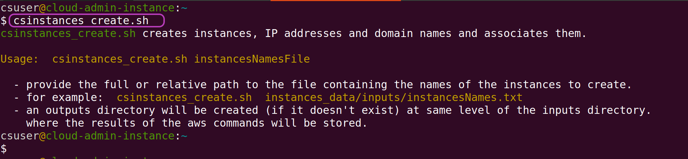

> ## Prerequisites
> To complete this episode you will need:
> - to have created and configured your AWS account as described in the two previous episodes: [Create Your AWS Account](./01-create-aws-account) and [Configure Your AWS Account](02-configure-aws-account).
> - to have the *terminal* program in your Linux machine configured to run the Bash shell.
> - to have installed the following programs in your Linux machine:\
>   `git`, `curl`, `unzip`, `ssh`
> - your programmatic access credentials:
>   - Access Key ID 
>   - Secret Access Key
>
> Those credentials are in the .csv file you downloaded once you created your IAM account as part of configuring your AWS account. 
{: .prereq}

# Introduction
This episode will guide you to configure your Linux machine so that you can run the Scripts to create and manage instances in your AWS account. 

**Configuring** your Linux machine includes: 

- installing the **Scripts**
- installing and configuring the **AWS CLI** to use your AWS account.

By **installing** the Scripts and the AWS CLI we mean both **downloading** them and **configuring** the execution path of your Linux machine so that the Scripts and the AWS CLI can be run from any location in your machine specifying only their name.

You **Linux machine** can be any of the following:
- a Linux laptop or desktop machine.
- a Linux virtual machine running within VMware (or Virtual Box, etc.) --- and VMware (Virtual Box, etc.) running on a Windows, Linux or MacOS laptop or desktop machine.
- a remote Linux server (e.g., an AWS Linux instance) accessed with `ssh`.
- Ubuntu Linux within the Windows Subsytem for Linux (WSL) running on a Windows laptop or desktop machine.

> ## Other options to run the Scripts whose configuration is **not covered** in this episode
> - **GitBash** running on a Windows laptop or desktop machine
> - a **terminal** running the Bash shell on a MacOS laptop or desktop machine
{: .callout}

# Outline 
> ## Steps
> These are the main steps you will follow to configure your Linux machine:
>
> 1. **[Install the Scripts](#1-installing-the-scripts).**\
> You will download the Scripts from GitHub and make them accessible through the execution path in your Linux machine.
>
> 2. **[Install and configure the AWS CLI](#2-install-and-configure-the-aws-cli).**\
> You will download the AWS CLI and make it accessible through the execution path in your Linux machine. You will then configure the AWS CLI to use the access key ID and a secret access key of your AWS IAM user account. 
{: .callout}

# 1. Installing the Scripts
## Download the Scripts from GitHub
To download the Scripts, open a terminal in your Linux machine and enter or copy-paste the git command below:
~~~
$ git clone https://github.com/Cloud-SPAN/aws-instances.git  ~/_tmp_cloudspan_aws
~~~
{: .bash}

## Make the Scripts accessible through the execution path
There are many ways to make the Scripts accessible through the execution path. To avoid any conflicts with the current configuration of your Linux machine, we are going to:
1. create a new "bin" directory
2. copy the Scripts to the new bin directory
3. add the new bin directory to the execution path

You can copy-paste the commands below to carry out those three steps using `~/.local/bincsaws` as the new bin directory, **but note**:

**If** `~/.local/bincsaws` **already exists** in your environment (which you can check with the command `ls ~/.local`), choose another name for `bincsaws` and use the new name instead of `bincsaws` in the three commands below:

~~~
$ mkdir -p ~/.local/bincsaws
$ cp ~/_tmp_cloudspan_aws/*.sh  ~/.local/bincsaws
$ echo "PATH=\"\$HOME/.local/bincsaws:\$PATH\"" >> ~/.bashrc
~~~
{: .bash}

The command `echo ... >> ~/.bashrc` adds an assignment shell statement at the end of the Bash configuration file `~/.bashrc`. The statement adds the new bin directory to the execution path which is held by the shell variable PATH.

Since the *terminal* program runs the commands in `~/.bashrc` every time it is launched, the assigment shell statement will add the "new" bin directory to the execution path on every subsequent launch of the *terminal*

That means that the Scritps **are just not yet accessible through the execution path**.

For the Scripts to become thus accessilbe, you need either to launch a new terminal or to run the `source` command to make the *terminal* run the commands in `~/.bashrc` again, and thus get the PATH variable updated within your **current** terminal session:

~~~
$ source ~/.bashrc
~~~
{: .code}

Once you have opened a new terminal or run the `source` command above, the Scripts will be accessible through the execution path and you should be able to run the command `csinstances_create.sh` as shown below. This script is one of the Scripts installed in `~/.local/bincsaws`.
~~~
$ csinstances_create.sh
~~~
{: .bash}

The output of `csinstances_create.sh` in your terminal should look like this:

{: width="900px"}

The script `csinstances_create.sh` was found and run, but as it requires a parameter (the name of a file), it only displayed the usage message and finished.

### Don't delete the directory `~/_tmp_cloudspan_aws` where the Scripts where downloaded

Please don't delete that directory just yet. We will use some files therein in the next lesson. Once we use those files you can delete that directory.

# 2. Install and configure the AWS CLI

Installing the AWS CLI involves downloading it and making it accessible through the execution path. 

Configuring the AWS CLI involves running it for configuration (`aws configure`) and entering the access keys of your IAM user account, the target AWS region, etc.

## Installing the AWS CLI

There are two options to install the AWS CLI that we call: automatic and manual. 

The automatic version is carried out by one of the Scripts that you installed in the previous section, but it only works if you installed the Scripts in the suggested directory `~/.local/bincsaws`. 

If you installed the Scripts somewhere else, then follow the instructions below under "Manual installation".

### Automatic installation

The script `aws_cli_install_update.sh` either installs or updates the AWS CLI. Enter its name and and press `y` when prompted as to whether to continue, as shown below.

~~~
$ aws_cli_install_update.sh
aws_cli_install_update.sh installs or updates the AWS CLI and the AWS completer locally.
 
Do you want to continue (y/n)?: 
~~~
{: .bash}

Once the script is finished, read the notes below under "After installing the AWS CLI".

### Manual installation
The manual installation consists of running the commands in the script `aws_cli_install_update.sh` one by one but replacing in two of them the name of the directory you used in your installation of the Scripts, see details below.

The commands have been commented and numbered in the code box below --- you can copy-paste them along with the comments which will be ignored by the *terminal*.

The commands you need to change are: 
- (6) INSTALL AWS CLI:
  - **within** `--bin-dir $HOME/.local/bincsaws`, **change only** `.local/bincsaws` to the name of the directory where you installed the Scripts.
  - you **do not need to change** `--install-dir $HOME/.local/aws-cli2` **unless** your environment is already using this directory. If you need to change it, change only `.local/aws-cli2` to the name of the directory where you want the AWS CLI and its libraries to be installed --- the directory that you specify will be created automatically even if you specify a directory within a directory, for example: `software/aws/installed`. 
- (7) INSTALL AWS CLI COMPLETER:
  - **within** `$HOME/.local/bincsaws/aws_completer`, **change only** `.local/bincsaws` to the name of the directory where you installed the Scripts.

~~~
$ cd	               ### (1) go to home directory
$ mkdir ___tmpaws      ### (2) create directory to download the AWS CLI
$ cd  ___tmpaws        ### (3) go to download directory
$                      ### (4) download the Scripts .zip file into current directory
$ curl "https://awscli.amazonaws.com/awscli-exe-linux-x86_64.zip" -o "awscliv2.zip" 

$ unzip awscliv2.zip   ### (5) unpack the Scripts: creates directory aws in current directory

$                      ### (6) INSTALL AWS CLI:
$ ./aws/install --bin-dir $HOME/.local/bincsaws --install-dir $HOME/.local/aws-cli2 --update

$                      ### (7) INSTALL AWS CLI COMPLETER:
$ echo "complete -C $HOME/.local/bincsaws/aws_completer aws" >> ~/.bashrc

$ cd                   ### (8) back to home directory to clean download directory
$ rm -fr  ___tmpaws
$ aws --version        ### run the AWS CLI (aws) to print its version
~~~
{: .bash}

### After installing the AWS CLI

Once the AWS CLI is installed, you need to log out and login again, or open a new terminal, for the installation to complete. As part of the installation, the file `~/.bashrc` was added the following command line at the end and it will only take effect when the terminal starts (or if `.bashrc` is source'd): 

`complete -C $HOME/.local/bincsaws/aws_completer aws`

Thanks to this command, when you use the AWS CLI, `aws`, if you press the `Tab` key once, the *completer* will try to complete the current option following `aws`, or if you press the `Tab` key twice, it will display the options available. See the examples below.
~~~
$ aws ec              ### Tab key pressed twice after "ec"
ec2                   ecr                   ecs                   
ec2-instance-connect  ecr-public          
$
$ aws ec2 create-i    ### Tab key pressed twice after "-i"
create-image                  create-internet-gateway       create-ipam-scope
create-instance-event-window  create-ipam                   
create-instance-export-task   create-ipam-pool              
~~~
{: .bash}

## Configuring the AWS CLI

To configure the AWS CLI, run the command `aws configure` as shown below, entering the following information when prompted: 
- the access key ID and the secret access key associated with your IAM user account
- for default region name, enter `eu-west-1` (Ireland)
- for default output format, enter: `json`

~~~
$ aws configure
AWS Access Key ID [None]: AVQN34BMZ4ADSXUFIAKI                             ### YOURS
AWS Secret Access Key [None]: XZVbQgWJeOVY43V2UdmrUkqIVo0/bSO3gtc4E3Lx     ### YOURS
Default region name [None]: eu-west-1                               
Default output format [None]: json
~~~
{: .bash}

To check the configuration of the AWS CLI, run the following command (use the `Tab` key to get options completed or displayed):
~~~
$ aws ec2 get-vpn-connection-device-types
~~~
{: .bash}

If your configuration is correct, you should see an output like this:
~~~
{
    "VpnConnectionDeviceTypes": [
        {
            "VpnConnectionDeviceTypeId": "36ef5d04",
            "Vendor": "Barracuda",
            "Platform": "NextGen Firewall F-Series",
            "Software": "6.2+"
        },
...
~~~
{: .output}

Your Linux machine environment is now configured to use the Scripts in the next lesson: [Managing AWS Instances](https://cloud-span.github.io/cloud-admin-guide-2-managing-aws-instances/).

If instead you see an authorisation failure message like the one below, your configuration of AWS CLI is not right. Run `aws configure` again and check that you properly copy-paste your keys and other information.
~~~
An error occurred (AuthFailure) when calling the GetVpnConnectionDeviceTypes operation: AWS was not able to validate the provided access credentials
~~~
{: .output}

<!-- > ## Note -->
<!-- > You can change the region any time you need.  -->
<!-- {: .callout} -->
